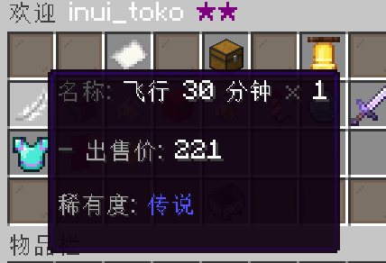

# 类型

## 物品商品

物品商品是最基本的商品，这种商品交易的是一个具体的游戏内物品。

包含 `item` 配置块（且不是捆绑包）的商品就会成为物品商品。

一个例子如下：

```yaml
DIAMOND:
  item:
    base: diamond
    name: "<blue>神奇钻石"
  buy-price:
    fixed: 1000
  sell-price:
    fixed: 200
  rarity: uncommon
```

该商品显示在商店中与被购买时的效果如下：


## 捆绑包

捆绑包是一种特殊的商品，该商品可以容纳复数其他商品，被玩家一齐购买或出售。

包含 `bundle-contents` 配置键且类型为列表的商品及被视为捆绑包商品。一个例子如下：

```yaml
WARM_COLOR_WOOL_BUNDLE:
  icon:
    base: barrel
    amount: 1
    name: "<white>暖色调羊毛捆绑包"
    lore:
      - "<gray>一个包含所有"
      - "<gold>暖色调<gray>羊毛的捆绑包."
  buy-price:
    bundle-auto-new: true
  sell-price:
    disable: true
  bundle-contents:
    - YELLOW_WOOL
    - BROWN_WOOL
    - MAGIC_ORANGE_WOOL
    - RED_WOOL:3
  rarity: rare
```

这个商品在商店与被购买时的效果如下：


:::info
捆绑包商品本身的 `item` 配置块中的内容会被忽略，这意味着一个商品**不能同时**为物品商品和捆绑包商品。
:::

## 虚拟商品

不是物品商品和捆绑包商品的其他商品都被视为虚拟商品。在虚拟商品被交易成功时，插件本身什么也不会做，交易的行为完全由用户定义的 [事件钩子](event-hook) 控制。你可以借此实现命令商品等等拓展功能。一个例子如下：

```yaml
FLY_PERMISSION:
  icon:
    base: feather
    name: "<white>飞行 30 分钟"
  sell-price:
    disable: true
  actions:
    on-give:
      - command{cmd=`lp user ${player_name} permission settemp cmi.command.fly true 30m`}
      - command{cmd=`tell ${player_name} 现在你可以用 /fly 命令飞行 30 分钟!`}
  rarity: ancient
```

该商品在商店中显示如下：



被购买时（`on-give` 钩子），服务器会执行 `LuckPerms` 插件的临时权限命令，给予购买者对应的飞行权限，并发送一条提示消息。

:::warning
若虚拟商品的 `actions` 配置块为空，则此时该商品没有实际意义，玩家在交易时只能感受到自己的余额变化。插件在加载这种商品时会在控制台发出警告。
:::
