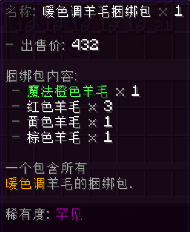
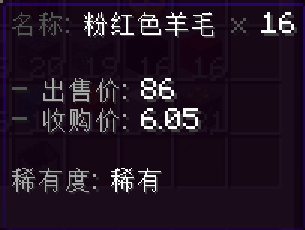

# 商店菜单

商店菜单配置定义了商店的外观，其配置格式与普通的 [菜单](../菜单/index) 基本相同，只是多出了几个商品图标配置。

一个普通的商店菜单配置如下：

```yaml
shop-gui:
  title: "普通的商店"
  scroll-mode: VERTICAL
  structure:
    - "p # d # m # @ # n"
    - "p x x x x x x x n"
    - "p x x x x x x x n"
    - "p # # # c # # # n"
  actions:
    on-outside-click:
      - open_gui{id="main-1"}
  icons:
    # 一系列图标配置
  product-icon:
    icon:
      name: "<dark_gray>名称: <reset>${product_name} <dark_gray>x <white>${product_amount}"
      lore:
        - " "
        - "?`<dark_gray>- <gray>出售价: <white>${format_decimal(buy_price)}`"
        - "?`<dark_gray>- <gray>收购价: <white>${format_decimal(sell_price)}`"
        - |
          product_is_stock ? " " : null;
        - "?`<dark_gray>总库存: <white>${current_global_stock}/${initial_global_stock}`"
        - "?`<dark_gray>每玩家库存: <white>${current_player_stock}/${initial_player_stock}`"
        - |
          bundle_contents_lore && bundle_contents_lore.length() > 0 ? [" ", "<gray>捆绑包内容:"] : null;
        - |
          bundle_contents_lore;
        - |
          desc_lore.length() > 0 ? " " : null;
        - |
          desc_lore;
        - " "
        - "<gray>稀有度: <reset>${product_rarity_name}"
        - " "
      actions:
        left:
          - |
            shopping_mode_id == "CART" ? add_to_cart{amount=1} : sell_to{amount=1};
          - update_icon()
        right:
          - |
            shopping_mode_id == "CART" ? remove_from_cart{amount=1} : buy_from{amount=1};
          - update_icon()
        shift-right:
          - if (shopping_mode_id == "DIRECT") buy_all_from();
          - update_icon()
        drop:
          - if (shopping_mode_id == "CART") remove_all_from_cart();
          - update_icon()
    format:
      bundle-content-line: " <dark_gray>- <reset>${product_name} <gray>x <white>${total_amount}"
```

最重要的部分是 `product-icon` 配置块，其定义了所有商品显示在商店中的图标的模板。

菜单配置的 `structure` 中 `x` 符号对应的位置显示的就是这个图标。

此配置中的模板显示在商店中的效果如下：

  

得益于 HS 的支持，你可以在一个 lore 列表中灵活地定义最终的显示效果，如对于普通商品，可以省略库存、捆绑包内容等无用的行。

在商品配置中定义的 `icon` 配置中的大部分属性都会被继承到这个图标上，除了：

- **name**：原始 `icon` 上的 `name` 的值可以通过变量 `product_name` 访问
- **lore**：原始 `icon` 上的 `lore` 的值会被注入到变量 `desc_lore` 中
