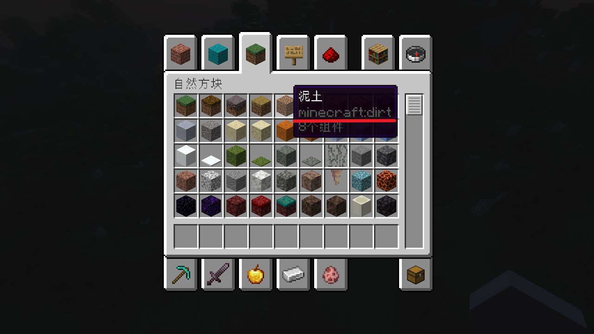

# 基本物品

基本物品是一个物品的最初状态，一个基本物品可以被装饰属性所修饰。本页展示了 `base` 键可以接受的一系列值。

## 原版物品

想要指定一个原版物品，大部分时候仅需使用其 [材质（Material）值](https://jd.papermc.io/paper/1.21.4/org/bukkit/Material.html) 的**小写**形式即可。

你可以在上述 Paper API 页面中查看材质值，也可以通过游戏内 `F3+H` 快捷键打开高级提示框查看：



图中划红色横线的部分就是完整的 Material 值。你可以将它们全部填入 `base` 中，也可以省略 `minecraft:` 部分。以下是一些例子：

```yaml
base: minecraft:dirt
base: dirt
base: diamond
base: enchanted_book
base: splash_potion
```

:::info
在插件内部，实际上使用 Paper API 中的 [材质注册表](https://jd.papermc.io/paper/1.21.4/org/bukkit/Registry.html) 查找原版物品。

上文说 `minecraft:dirt` 是 Material 值实际上并不准确，因为它实际上是 `泥土` 这一材质的枚举值在注册表中的键的字符串值。

待 `ItemType API` 稳定后应被替换。

:::

## 头颅物品

头颅物品用 `SKULL:数据` 格式定义：

```yaml
base: SKULL:http://textures.minecraft.net/texture/7f9bc035cdc80f1ab5e1198f29f3ad3fdd2b42d9a69aeb64de990681800b98dc
base: SKULL:eyJ0ZXh0dXJlcyI6eyJTS0lOIjp7InVybCI6Imh0dHA6Ly90ZXh0dXJlcy5taW5lY3JhZnQubmV0L3RleHR1cmUvYTljYmQ4NzQ4NTgyZGM2ODUyNmIwYTI5OTU1ZjU4ZjdlNmNiZGE0ODBhMDQ1NWU4NjUzNGM2ZDIxMDY1MTcxMyJ9fX0
```

其中的数据可以是一个指向标准皮肤文件的链接，也可以是一个皮肤数据的 `base64` 编码值。

你可以在 [Minecraft Heads](https://minecraft-heads.com/) 查找想要的头颅的 `base64` 编码值和皮肤链接，选择喜欢的头颅后在页面底部即可找到：


## MMOItems 插件物品

插件支持在 base 中使用 [MMOItems](https://www.spigotmc.org/resources/mmoitems.39267/) 插件的物品，导入的物品会保留来自该插件的一切属性和随机特性等，配置格式为 `MI:类型:ID`：

```yaml
base: MI:SWORD:LONG_SWORD
```

## MythicMobs 插件物品

插件支持在 base 中使用 [MythicMobs](https://www.spigotmc.org/resources/⚔-mythicmobs-free-version-►the-1-custom-mob-creator◄.5702/) 插件的物品，导入的物品会保留来自该插件的一切属性，配置格式为 `MM:ID`：

```yaml
base: MM:SkeletonKingSword
```

## ItemsAdder 插件物品

插件支持在 base 中使用 [ItemsAdder](https://www.spigotmc.org/resources/✨itemsadder⭐emotes-mobs-items-armors-hud-gui-emojis-blocks-wings-hats-liquids.73355/) 插件的物品，导入的物品会保留来自该插件的一切属性，配置格式为 `IA:namespacedId`：

```yaml
base: IA:iasurvival:tuna
```
