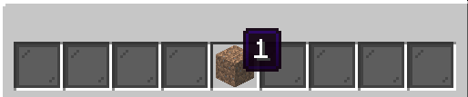
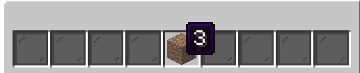
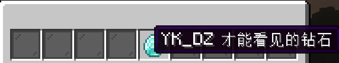
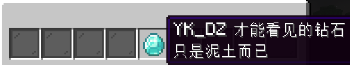

# 图标属性

菜单图标拥有一些特殊的属性，用于定义自动刷新、子图标等行为。它们的地位与 [装饰属性](../../物品定义/decorator) 基本相同。

## update-period

`update-period` 定义了一个图标的更新频率，接受一个普通字符串作为值，格式为 [时间字符串](../../杂项/duration-format)。

```yaml
update-period: 1s
update-period: 0.5s
update-period: 1m 5s
```

## update-on-click

`update-on-click` 接受一个普通布尔值作为值，为 `true` 时，图标会在被点击（左键、右键等）时更新一次。

```yaml
update-period: true
```

## icons

`icons` 定义了一个图标的若干子图标，每个子图标由**显示条件**、**杂项配置**和**图标属性**三部分组成，其接受一个配置块列表作为值。

举个例子：

```yaml
"i":
  base: dirt
  name: "普通的泥土"
  icons:
    - condition: player_name == "YK_DZ"
      icon:
        name: "YK_DZ 才能看见的泥土"
        lore:
          - "还有特殊的 lore"
    - condition: papi("%world_time_world%").split(":")[0] > 22
      priority: 10
      icon:
        name: "深夜才能看见的泥土"
```

当查看此图标的玩家名称为 `YK_DZ` 时，此图标会显示为 `只有 YK_DZ 才能看见的泥土`，而在世界 `world` 的晚上十点到十二点则会显示为 `深夜才能看见的泥土`。其余情况则显示为 `普通的泥土`。

### 显示条件

`condition` 定义了子图标显示的前提条件，接受一个 HS 脚本字符串为值。只要此脚本的输出值为 `true`，则认为此图标满足条件，将被显示。

一个子图标必须有 `condition` 配置，否则会被跳过。

### 优先级

子图标的计算顺序由**优先级**决定，优先级的数值越大，越先被计算。第一个满足条件的子图标会被应用，并不再计算其他子图标。

默认处于配置最上方的图标优先级最高，值为子图标数量 `n`、下一个图标优先级则为 `n - 1`，依此类推。用 `priority` 属性则可以覆盖此优先级设置。

```yaml
"i":
  base: dirt
  name: "0"
  icons:
    - condition: true
      icon:
        name: "1"
    - condition: true
      icon:
        name: "2"
    - condition: true
      icon:
        name: "3"
```

此图标在菜单中永远显示为 `1`。



而手动调整优先级后则永远显示为 `3`。



### 继承

每个子图标都**默认继承**父图标的所有属性，如上例中子图标都没有自己的 `base` 属性，则显示时自动使用来自父图标的 `base: dirt`。

你可以通过设置 `inherit: false` 禁用这种继承关系。

```yaml
"i":
  base: dirt
  name: "普通的泥土"
  lore:
    - "只是泥土而已"
  icons:
    - condition: player_name == "YK_DZ"
      inherit: false
      icon:
        base: diamond
        name: "YK_DZ 才能看见的钻石"
```

上例中 `YK_DZ` 查看图标时，钻石上不会出现 `只是泥土而已` 的 lore。



而去掉 `inherit: false` 后此 lore 会被继承到子图标上。


